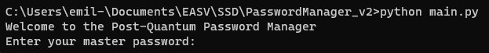
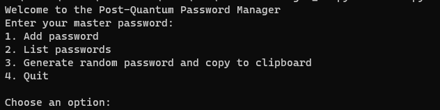
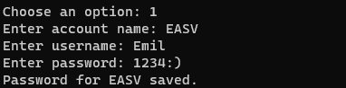
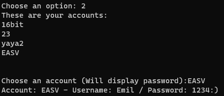
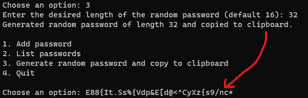

# Python Password Manager

This application is a Post-Quantum Password Manager that allows users to store their credentials safely in an encrypted local .txt file (The vault).

The initial idea was to make it safe in a post-quantum world where certain encryption algorithms will become insecure.

My understanding is that AES is a symetric encryption type, and therefor it is quantum secure if the key is long enough, in this application it is 256-bit - But to be honest I don't know if it actually is quantum secured.

* The manager accepts a master password for encryption, you can then add or list passwords to/from the vault.
* The application also has a function to generate a random password, of any desired length, and copies it to the clipboard.
* The application use cryptography libraries such as scrypt key derivation function, AES encryption with CBC mode, and applies padding to ensure proper data security.
* The application uses salt in order to secure the user against rainbow tables
* One issue, or argueably security feature, of the application is that it does not have any recovery options. If you loose your master password, your vault is forever lost.
* Currently the application is a single user application, meaning the user cannot have multiple masterpasswords, unless they wanna manage the password files manually by renaming them accordingly.


#

## (Optional) - Make the application an actual application:
```console
pip install pyinstaller
pyinstaller --onefile main.py
``` 

#

## How to use the application

The first time you run the application it sets your master password.



This is the same screen you see when you will try to access your existing vault 

#


Once succefully logged in you will see the following menu




#

### Add credentials:


Provide account name, username and password



Once you see "Password for {account} saved." it is apended to your vault encrypted with the masterpassword.

#

### List passwords:

First you will receive a list of all stored accounts.

Enter the name of the account you wish to see the password for. 



#

### Generate random password:

This function prompts the user for a desired length

And then proceeds to generate a random string, consisting of the following chars: 

     # a-z A-Z 0-9 and punctuations
     abcdefghijklmnopqrstuvwxyzABCDEFGHIJKLMNOPQRSTUVWXYZ0123456789!"#$%&'()*+,-./:;<=>?@[\]^_`{|}~. 





#

### Hack for sharing vault on multiple devices:
Save the application in a dropbox folder, mount this dropbox folder to a new device.

#

### Known Bugs:

* If you add a password with using the same account name twice, the first entry will be deleted and only the latest entry with that account name is saved. 


### Conclusion:
Very rough and unforgiving application, but very secure if you keep your masterpassword too your self.